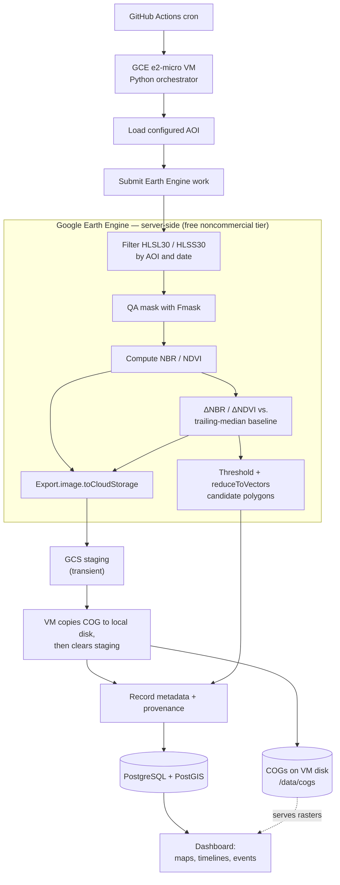
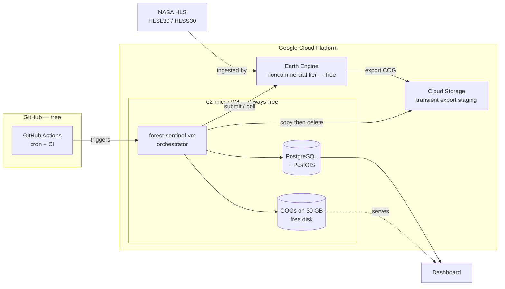

# Open Forest Sentinel

Open Forest Sentinel is a generalized, low-cost **forest disturbance monitoring and evidence system** for a configurable **Area of Interest (AOI)**. The initial deployment target is the **Solomon Islands**, but arbitrary AOI deployability is a first-class feature: the same system should work for other countries, regions, protected areas, watersheds, concessions, or custom polygons through configuration rather than code changes.

The project uses openly available earth-observation data to detect, track, and explain likely forest disturbance. The first implementation should use **NASA HLS optical imagery** as the primary analytical backbone, with **Sentinel-1 SAR** planned as the main complementary data source for cloud-resilient monitoring.

For an appropriately constrained AOI, the system should be able to run at near-zero or very low infrastructure cost because free-tier / low-cost cloud resources are sufficient for compute, database, and prototype raster storage.

A key value proposition is **observation currency**: by using openly available imagery with frequent Landsat/Sentinel revisit cadence, the system should deliver forest-disturbance insights that are typically **less than one week old** and refreshed **more frequently than weekly**, subject to cloud cover, data availability, AOI size, and processing schedule.

Because tropical forest monitoring is often limited by cloud cover, the system should be designed to preserve observation currency even when optical imagery is partially unavailable. The first operational version may rely primarily on cloud-masked HLS optical change products, but the architecture should support later fusion with **Sentinel-1 radar observations**, allowing disturbance evidence to be generated or corroborated during cloudy periods.

## Product Deliverable

The final user-facing deliverable is not just a set of derived raster files. It is a lightweight dashboard that helps users understand:

- where likely logging or forest disturbance is happening
- when disturbance was first detected
- how large the affected area is
- how quickly the disturbance is expanding
- which detections are new, ongoing, resolved, or uncertain
- what satellite-derived evidence supports each detection
- which sensor or method produced the detection
- whether the detection is based on optical imagery, radar imagery, or both
- whether cloud cover, stale imagery, or conflicting evidence affects confidence
- how the detected disturbance relates to contextual evidence such as concessions, protected areas, roads, rivers, settlements, mills, ports, or other relevant legal / infrastructure layers

The derived raster products are internal analytical artifacts used to power detection, tracking, visualization, review, and auditability.

## Methodology

The initial methodology should prioritize transparent, reproducible, rule-based detection before introducing heavier machine-learning approaches.

### Optical Disturbance Detection

The first vertical slice should use **HLS analysis-ready optical imagery** as the primary data source, accessed and processed through **Google Earth Engine** (see `docs/architecture.md` §4a). Indices are computed server-side in Earth Engine:

- NBR = `(NIR - SWIR2) / (NIR + SWIR2)`
- NDVI = `(NIR - RED) / (NIR + RED)`

The system should compare recent valid observations against a historical baseline, such as a rolling or seasonal median, to produce change products such as:

- ΔNBR
- ΔNDVI
- other anomaly measures

Clouds, cloud shadow, haze, and low-quality pixels should be masked using available HLS QA layers. Optical detections should retain quality metadata so the dashboard can distinguish strong evidence from uncertain or partially obscured observations.

### Cloud-Resilient Radar Augmentation

The architecture should support **Sentinel-1 SAR** as the primary non-optical augmentation layer. **SAR** stands for **Synthetic Aperture Radar**. Unlike optical sensors, which passively measure reflected sunlight, SAR actively sends microwave pulses toward the Earth and measures the returned signal. This makes SAR useful through cloud cover, haze, smoke, and darkness, which is especially important for tropical forest monitoring.

The first radar augmentation should prioritize **Sentinel-1 GRD backscatter / intensity change detection**. GRD, or **Ground Range Detected**, is the more practical first implementation target because it is already processed into a radar image product suitable for comparing backscatter intensity over time. Sudden or persistent backscatter changes may indicate canopy disturbance, clearing, exposed soil, flooding, or other surface-structure changes.

More advanced **SLC-based** methods may be considered later. **SLC** means **Single Look Complex**. SLC products preserve both radar amplitude and phase, enabling methods such as coherence change detection and interferometric analysis. In forest monitoring, coherence change can help detect structural disruption between paired SAR acquisitions, but it is more complex than GRD backscatter analysis and is sensitive to orbit pairing, acquisition geometry, time interval, vegetation moisture, and preprocessing choices.

Planned radar-derived signals may include:

- Sentinel-1 GRD backscatter / intensity change
- Sentinel-1 coherence change, if SLC-based processing is later justified
- radar-confirmed disturbance candidates
- radar-only disturbance candidates in areas where optical imagery is cloud-masked or stale

The initial implementation does not need to solve full SAR processing immediately. It should treat **GRD backscatter change** as the realistic first SAR path, while keeping the data model and dashboard flexible enough to support later SLC-based coherence methods without changing the core event model.

### Evidence Fusion and Confidence

The system should maintain a transparent confidence model rather than treating all detections equally.

Candidate disturbance confidence should account for:

- optical change magnitude
- radar change magnitude, where available
- persistence across multiple observations
- agreement between optical and radar signals
- cloud / shadow / haze conditions
- time since last valid cloud-free optical observation
- proximity to roads, rivers, settlements, concessions, or other contextual layers
- manual review status

Each detection should preserve enough provenance to answer:

- what was detected
- when it was first detected
- which sensor observed it
- which method version produced it
- what quality masks were applied
- whether the detection was optical-only, radar-only, or fused
- why the system assigned its confidence level

## Contextual Evidence Layers

The project should not stop at pixel-level forest-loss detection. Forest disturbance becomes more useful for illegal-logging review when combined with legal, spatial, and infrastructure context.

Supported or planned contextual layers may include:

- concession boundaries
- protected areas
- customary, indigenous, or community land boundaries
- harvest permit areas or authorized operating zones
- roads and logging roads
- skid trails
- rivers and landing sites
- settlements
- mills
- ports
- export or transport chokepoints

These layers help convert raw disturbance detections into reviewable intelligence. For example, a disturbance polygon outside an authorized concession, near a newly visible road, and expanding toward a river landing may be higher priority than an isolated low-confidence spectral anomaly.

Additional weak signals, such as night-time lights anomalies or mill / port / export inconsistencies, may be useful later as prioritization or corroboration layers. They should not be treated as primary proof of illegal logging without supporting spatial and satellite-derived evidence.

## Data Pipeline



1. **GitHub Actions** runs on a schedule and triggers the pipeline. *(Target design — today the shipped scheduler is a systemd timer on the VM; see `DEPLOYMENT.md` §7.)*
2. A **Google Compute Engine VM** executes the Python orchestration job (it submits Earth Engine work and ingests results).
3. The pipeline loads the configured AOI geometry.
4. The pipeline accesses relevant **HLS analysis-ready imagery through Google Earth Engine** (`HLSL30` / `HLSS30`).
5. Earth Engine computes vegetation/disturbance indices such as NBR and NDVI server-side.
6. The system applies QA masking — currently the HLS `Fmask` band: cloud, cloud shadow, snow/ice, and high aerosol are masked; water and low/moderate aerosol are deliberately kept (see `docs/architecture.md` §5.4).
7. The system computes change products such as ΔNBR / ΔNDVI or other anomaly measures against a historical baseline.
8. Change signals are converted into candidate disturbance polygons.
9. Candidate polygons are tracked over time as disturbance events.
10. Where available, complementary observation streams such as **Sentinel-1 SAR** can be used to fill cloud gaps, corroborate optical detections, or flag radar-only disturbance candidates.
11. Contextual layers such as concessions, protected areas, roads, rivers, settlements, mills, and ports are joined to disturbance events.
12. Outputs are exposed through a dashboard with maps, timelines, event detail views, confidence explanations, and AOI summary metrics.
13. Earth Engine exports raster artifacts as **Cloud Optimized GeoTIFFs (COGs)** to a transient Google Cloud Storage staging area; the VM copies them to its local disk (the canonical store) and clears the staging object, keeping raster storage at $0.
14. Metadata, provenance, AOIs, detections, event histories, contextual overlays, and manual review records are stored in **PostgreSQL + PostGIS**.

## Prototype Technology Stack

- **Scheduler / trigger:** GitHub Actions cron (target; today a systemd timer on the VM — see `DEPLOYMENT.md` §7)
- **Compute:** Google Compute Engine VM
- **Prototype database:** PostgreSQL + PostGIS running on the same Compute Engine VM
- **Future managed database option:** Cloud SQL for PostgreSQL with PostGIS
- **Language:** Python
- **Imagery access & raster compute:** Google Earth Engine (`earthengine-api`) — server-side index, change, and candidate computation
- **Local raster handling (planned):** rasterio, GDAL, rio-cogeo (COG validation on ingest is a future bead); numpy. Today EE-exported COGs are copied to disk as-is.
- **Imagery source, first vertical slice:** NASA HLS (`HLSL30` / `HLSS30`), accessed via Google Earth Engine
- **Planned radar augmentation:** Sentinel-1 SAR, starting with GRD backscatter / intensity change detection
- **Possible future reference layers:** GEDI / canopy structure products, ALOS / PALSAR-derived products, night-time lights, infrastructure and legal boundary datasets
- **Raster output format:** Cloud Optimized GeoTIFF (written by Earth Engine export)
- **Raster storage:** local VM filesystem, e.g. `/data/cogs/` (canonical); GCS used only as a transient EE-export staging area, then cleared
- **Future raster storage:** Google Cloud Storage (when COG volume outgrows the free VM disk)
- **Dashboard:** lightweight web application backed by PostGIS
- **Versioning / CI:** GitHub

## Infrastructure Architecture

The prototype targets **$0/month** by staying inside always-free tiers: GitHub Actions, the Earth Engine noncommercial tier, and a single always-free `e2-micro` VM that hosts the orchestrator, PostgreSQL + PostGIS, and the canonical COG store on its free disk. Earth Engine performs the heavy raster compute server-side; Cloud Storage is used only as a transient export staging area, cleared after each COG is copied to the VM. See `docs/architecture.md` §4b for the full cost model.



## Core Domain Objects

- `aoi`: configured area of interest geometry and metadata
- `observation`: one imagery acquisition/date used for analysis, including sensor, timestamp, cloud/quality metadata, source scene identifiers, and observation type
- `sensor_source`: source dataset metadata, such as HLS, Sentinel-1, Landsat, Sentinel-2, GEDI, or other future inputs
- `quality_mask`: cloud, shadow, haze, missing-data, water, or other observation-quality metadata
- `index_raster`: derived NBR / NDVI raster metadata
- `change_raster`: ΔNBR / ΔNDVI or anomaly raster metadata
- `change_raster_source`: provenance link from a change raster to every index raster (current + baseline) that contributed to it
- `radar_change_raster`: Sentinel-1-derived GRD backscatter/intensity, future SLC-based coherence, or other SAR change metadata
- `disturbance_candidate`: raw detected disturbance polygon
- `disturbance_event`: tracked logging/disturbance event over time
- `event_observation`: per-date measurement of event area, severity, growth, confidence, and evidence source
- `context_layer`: legal, administrative, infrastructure, or environmental overlay dataset
- `event_context`: relationship between a disturbance event and relevant contextual features, such as concessions, roads, rivers, protected areas, mills, or ports
- `manual_review`: human validation, notes, uncertainty, false-positive status, and evidence interpretation
- `methodology_version`: processing and detection method provenance
- `confidence_assessment`: structured explanation of why an event received a given confidence level

## Core Value Proposition

The project is a reusable template for deploying a lightweight satellite-derived forest monitoring system over any reasonably sized AOI. Cost scales primarily with AOI size, processing frequency, output retention, raster storage volume, contextual data volume, and dashboard usage.

The product value comes from turning free, openly available earth-observation data into timely, actionable dashboard views showing likely logging activity, detection timing, expansion rate, confidence, and supporting evidence.

Its practical advantage depends not only on low cost, but also on **temporal currency** and **evidentiary usefulness**. Frequent sensor revisit and scheduled processing allow detections to be refreshed more often than weekly and kept close to real time for small-to-medium AOIs. Complementary radar observations can help preserve coverage when clouds interfere with optical imagery. Contextual layers such as concessions, protected areas, roads, rivers, mills, and ports help turn generic forest-disturbance detections into reviewable intelligence for illegal-logging monitoring.

## Usage

> Standing this up for your own AOI — credentials, the $0 GCP infrastructure, and
> scheduled runs? The fastest path is **[INSTANCE_DEPLOYMENT.md](INSTANCE_DEPLOYMENT.md)**:
> create your own repo with "Use this template" and let a GitHub Action provision
> everything (keyless). For the manual route see **[DEPLOYMENT.md](DEPLOYMENT.md)** —
> or **[docs/cloud-shell-setup.md](docs/cloud-shell-setup.md)** to do it all from a
> browser with no local tooling.

An AOI is a GeoJSON file containing a single `Feature` whose geometry is the area to monitor and whose `properties.name` identifies it — see `examples/aoi-sample.geojson`.

**Load an AOI (Slice 0 walking skeleton):**

```sh
uv run forest-sentinel run --aoi examples/aoi-sample.geojson
```

This loads and validates the AOI, persists it to the database, and prints a summary.

**Run the full Slice 1 optical-change pipeline** by adding a time window:

```sh
uv run forest-sentinel run \
  --aoi examples/aoi-sample.geojson \
  --since 2026-01-01 --until 2026-02-01 \
  [--baseline-window 5] [--threshold -0.25] [--min-area 4500] \
  [--methodology-name optical-change] [--methodology-version 1.0.0] \
  [--gee-project YOUR_GCP_PROJECT]
```

The bracketed flags are optional and shown with their default values.

This discovers HLS observations through Google Earth Engine, computes Fmask-masked NBR/NDVI and ΔNBR/ΔNDVI server-side, polygonizes disturbance candidates, exports COGs to local disk via a transient GCS staging area, persists everything to PostGIS, and prints a per-stage summary. The run is **idempotent** at the AOI level (it reuses the AOI row by name) and blocks while polling each Earth Engine export to completion.

Earth Engine access requires a GCP service account with Earth Engine enabled and an EE-registered Cloud project. Configure:

| Variable | Purpose |
|----------|---------|
| `FOREST_SENTINEL_GEE_PROJECT` | EE-registered GCP project id (or pass `--gee-project`) |
| `FOREST_SENTINEL_GCS_STAGING_BUCKET` | transient bucket Earth Engine exports COGs into |
| `FOREST_SENTINEL_COG_ROOT` | local canonical COG directory (default `data/cogs/`) |
| `GOOGLE_APPLICATION_CREDENTIALS` | optional service-account key for local dev — credentials are otherwise ambient (attached service account on the VM, `gcloud auth application-default login` locally) |

The run also tracks candidates into disturbance events (overlapping candidates across dates become one event with a growing footprint and a per-date timeline).

**View the dashboard:**

```sh
uv run uvicorn forest_sentinel.dashboard.app:app --port 8000
```

Open <http://localhost:8000> for a Leaflet map of disturbance events per AOI, with per-event timelines (size and expansion), status, and supporting evidence. The dashboard is read-only and unauthenticated in this slice; it also exposes a JSON/GeoJSON API under `/api`.

Later slices add scheduled execution, manual review, confidence scoring, and radar (see `docs/work-plan.md`).

## Development

In **GitHub Codespaces**, opening the repository builds a devcontainer that installs dependencies and starts the database automatically, so `uv run forest-sentinel run --aoi examples/aoi-sample.geojson` works immediately. The steps below cover local development.

The project targets **Python 3.12** and uses [uv](https://docs.astral.sh/uv/) for dependency and environment management. Tests that touch the database need PostgreSQL + PostGIS running locally, provided by `docker compose`.

```sh
uv sync                       # create the virtualenv and install dependencies
docker compose up -d          # start PostgreSQL + PostGIS (for database-backed tests)
uv run pytest                 # run the test suite
uv run ruff check .           # lint
uv run ruff format .          # format (use --check in CI)
uv run mypy                   # type-check
```

The database URL is read from `FOREST_SENTINEL_DATABASE_URL`, defaulting to the local `docker compose` instance. Apply schema migrations with `uv run alembic upgrade head`.

Work is organized as epics, vertical slices, and beads — see `docs/work-plan.md` and `docs/beads.md`.
